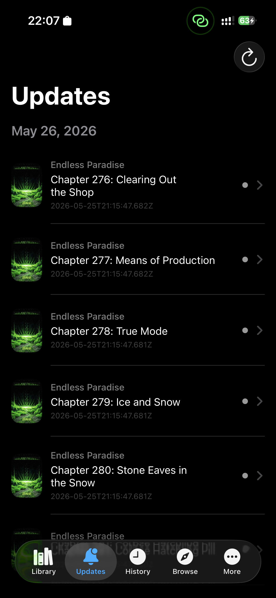
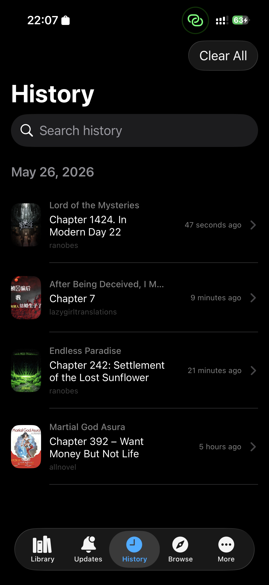
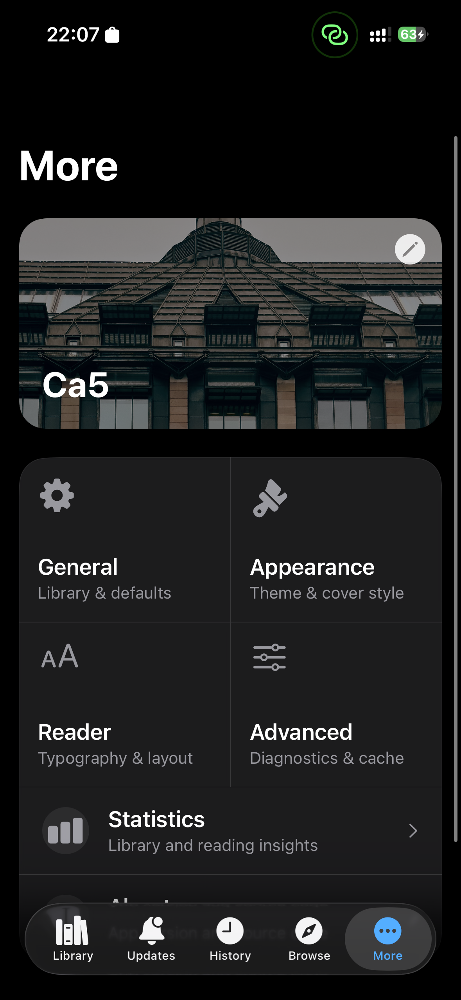

# LNReader

A cross-platform light novel reader application for Android and iOS.

## Features

LNReader provides a seamless reading experience with a comprehensive library management system, customizable reader settings, and synchronized progress across devices.

## Screenshots

## Contributing

We welcome contributions from the community. Please follow these guidelines when submitting changes:

### Getting Started

1. Fork the repository
2. Clone your fork locally
3. Install dependencies with `pnpm install`
4. Create a feature branch for your changes

### Development Process

1. Create a new branch for your feature or fix
2. Make your changes with clear, descriptive commits
3. Test your changes thoroughly
4. Ensure code follows the project's style guidelines
5. Submit a pull request with a clear description of changes

### Code Quality

- Write clean, readable code
- Include comments for complex logic
- Follow existing code conventions in the project
- Test both Android and iOS platforms when applicable
- Keep pull requests focused and reasonably sized

### Reporting Issues

- Check existing issues before creating a new one
- Provide detailed steps to reproduce bugs
- Include relevant logs, screenshots, or error messages
- Specify your device, OS version, and app version

### Types of Contributions

- Bug fixes and improvements
- New features and enhancements
- Documentation updates
- Translation contributions
- Performance optimizations
- UI/UX improvements

### Before You Submit

- Run tests locally and ensure they pass
- Check that your changes don't break existing functionality
- Update documentation if you've changed behavior
- Keep your commits organized and descriptive

For detailed contribution guidelines, see [CONTRIBUTING.md](CONTRIBUTING.md).
